# [EdgeX Foundry(TM) - Build Simple Data Monitor UI #03 - Features](https://www.topcoder.com/challenges/a3e6a611-0bea-4bb7-b77d-0c371c166136?tab=details)

## Disconnected state
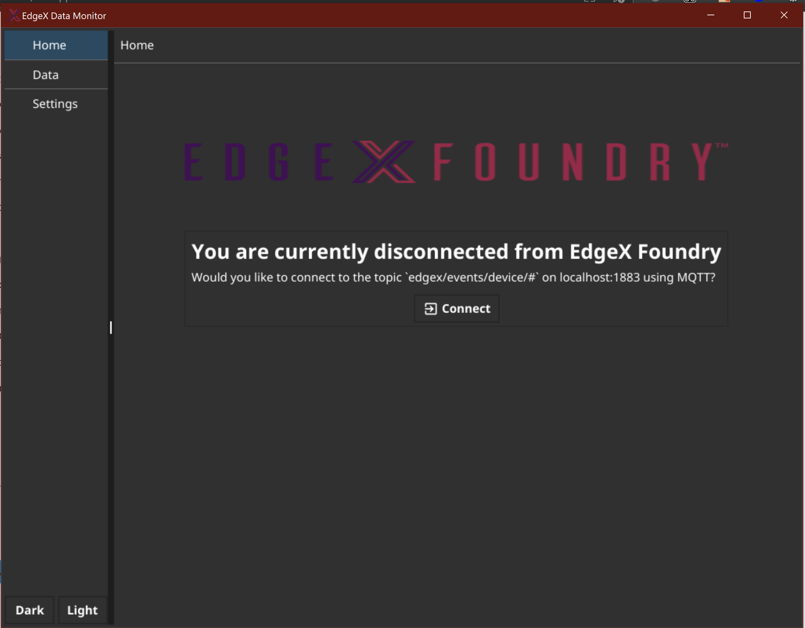
added topic and details about the messaging protocol

## Pause feature
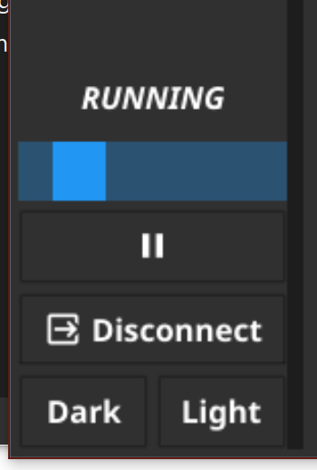
Pause/Unpause button and visual indication of the Data page status.

When paused, the user will filter on the paused state, the buffer will continue filling up in the background.
Unpausing resumes normal operation.

All the active filters are preserved.

## New Data Page
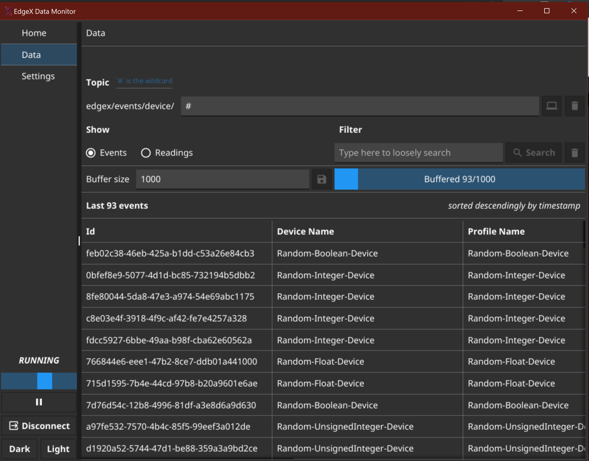
Added topic filtering.
The application shows the root of the events stream it's subscribed to and allows the user to refine down.
For example by replacing the wildcard `#` with `#integer#` you would only see events from `Random-Unsigned-Integer-Device` and `Random-Integer-Device`.
If you need more granularity. You can try with something like `#Int16` and you'll filter down to events from the topic `Random-Integer-Device/Random-Integer-Device/Int16`.
Precise inputs without wildcard work as well.

## New Settings Page
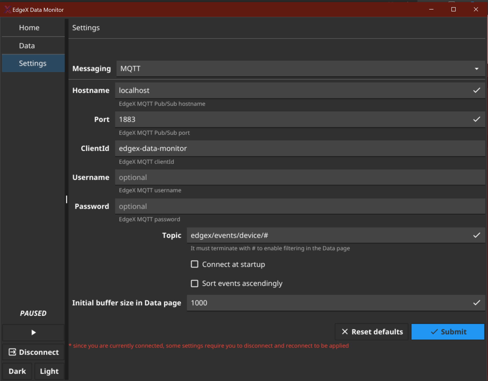
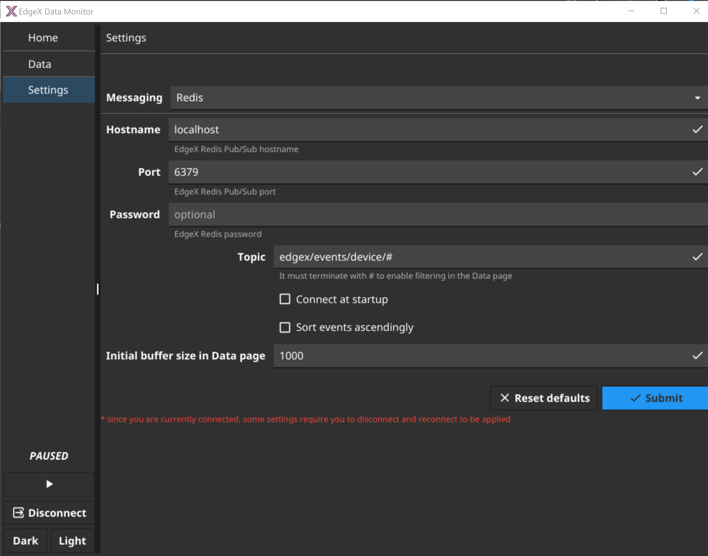

The new settings page now handles the 2 messaging brokers (Redis and MQTT) with added the optional parameters.

It also supports the Topic option. Please note that if the topic doesn't specify a wildcard, it would mean that it's already filtering down to one single topic and it would disable topic filtering in the Data page.

This is because if the user subscribes to `Random-Integer-Device/Random-Integer-Device/Int16`, they will only see these events, nothing to filter down.

---
Challenge #2 & #1 legacy features

## Data page
The data page allows the user to view Events
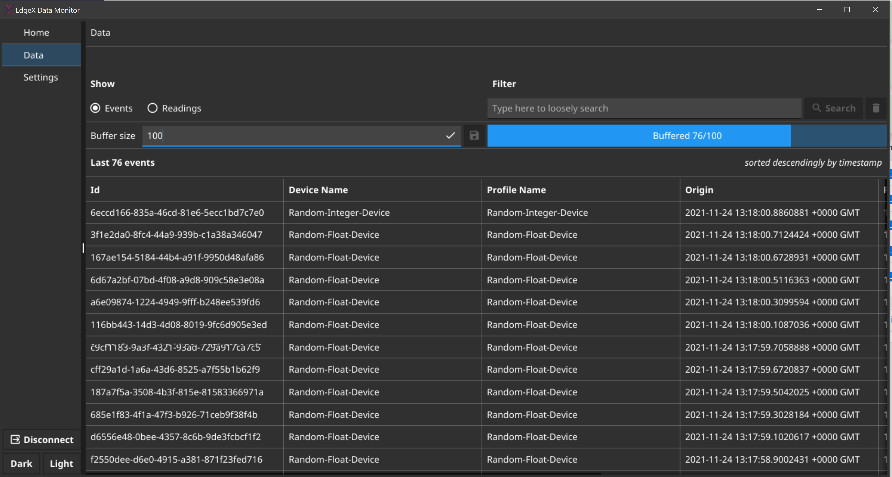

and Readings
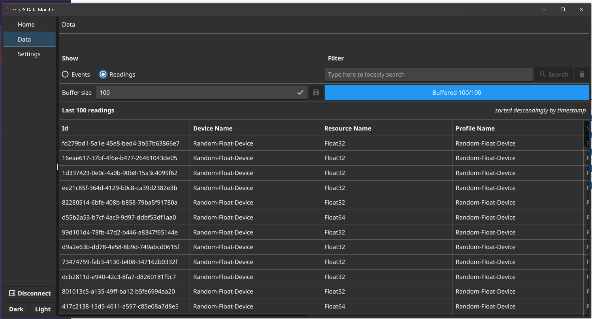

as they are ingested.

### Buffer size
It has a configurable "Buffer size" that indicates the number of events/readings that are gonna be kept in memory for further inspection. When the buffer is full, the oldest event/reading is dropped.
The initial value can be changed in the Settings page:

### Filter
The filter effectively starts a "live query" on the data.
It means that it will match events/readings matching in a case-insensitive way their properties with the filter.
The query is run on the buffer and it means that the results will change as the events/readings are dropped/received.
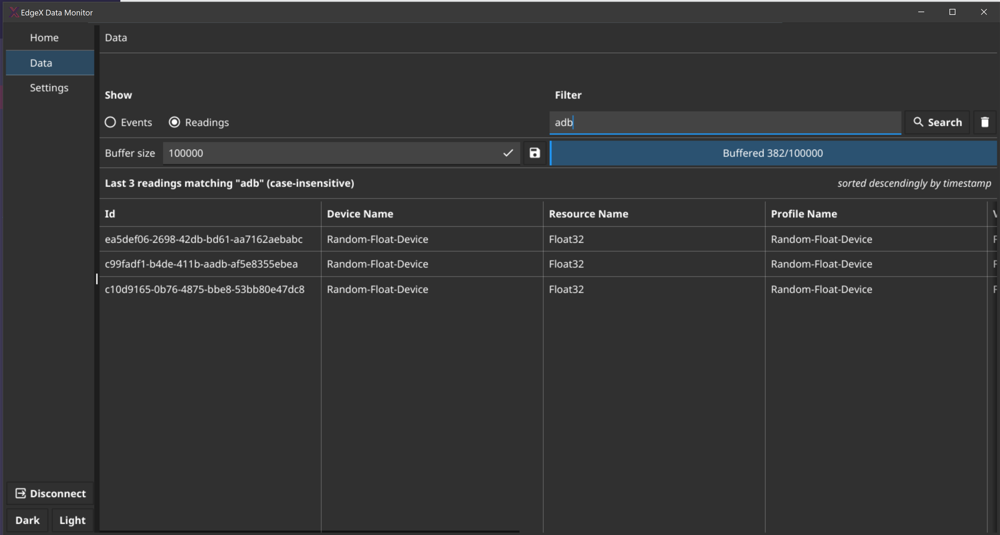

If the user is viewing readings, the query will match also the parent event properties as per requirements
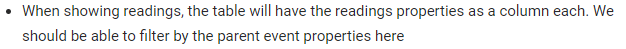

Clicking on an event/reading allows the user to inspect the JSON.
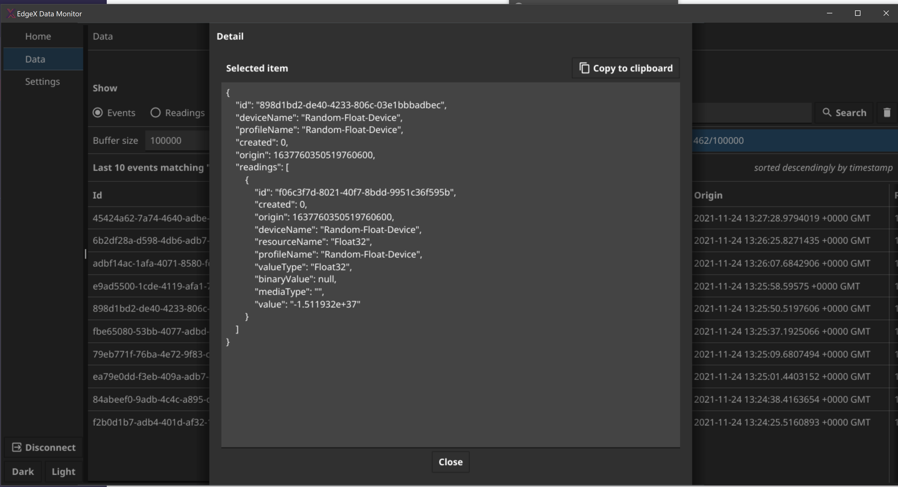
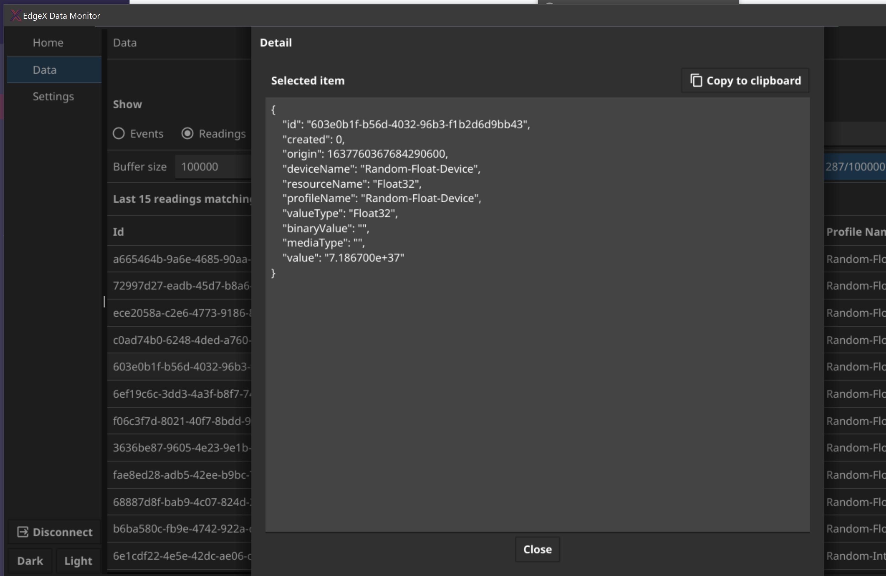

