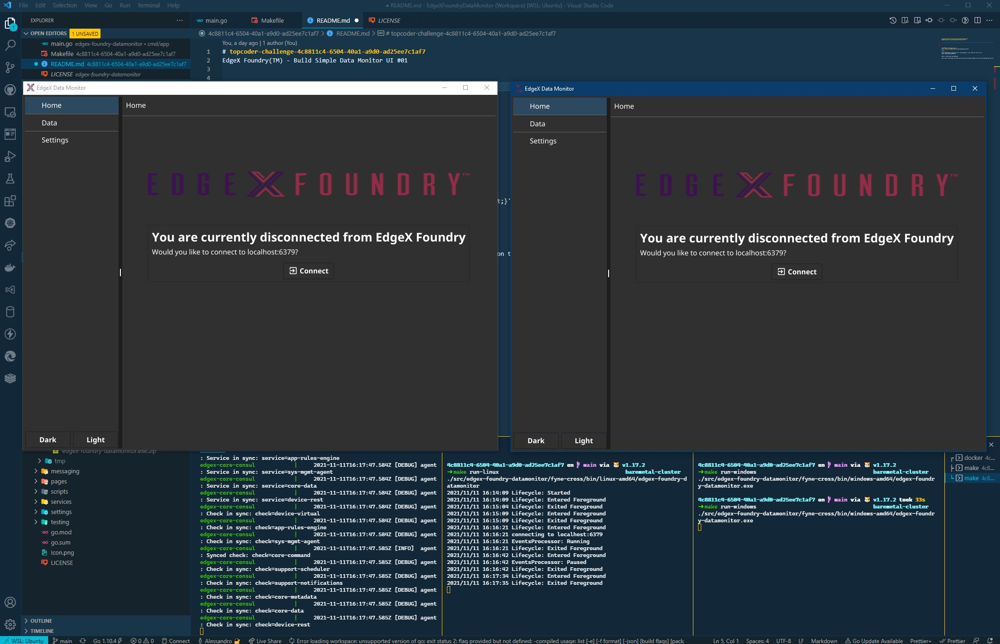

# [EdgeX Foundry(TM) - Build Simple Data Monitor UI #03](https://www.topcoder.com/challenges/a3e6a611-0bea-4bb7-b77d-0c371c166136?tab=details)


TLDR; left is Linux, right is Windows



For a full description of the Application features, please refer to the [Features](./FEATURES.md)

## General Requirements
- Docker
- Docker Compose
- Golang 1.16+


## Folder structure
- assets (supporting documentation and the application)
- licenses (OSS licenses for the dependencies)
- mqtt-config (overridden configuration for `device-virtual` that redirects the events to MQTT when running in that environment)
- src (contains the application itself)

### Windows Requirements

Please follow the [Fyne setup guide](https://developer.fyne.io/started/#prerequisites) in order to be able to run and build the application natively.
Generally speaking you need `Go` and a C compile `gcc`


## Messaging Setup

The application supports **Redis Streams** and **MQTT** as message brokers.
I am providing the official docker-compose files generated by [edgex-compose/compose-builder]( https://github.com/edgexfoundry/edgex-compose)
### Redis Streams

In order to setup the environment to use **Redis** you have to run:
```bash
docker-compose up -d
```
which will pick up `docker-compose.yml` by default

### MQTT

In order to setup the environment to use **MQTT** you have to run instead:
```bash
docker-compose -f docker-compose-mqtt.yml up -d
```
## How to Run the application

From inside the folder `./src/edgex-foundry-datamonitor`

(Please note that you might have to run `chmod +x ./scripts/*.sh` after unzipping in order to run the scripts otherwise you would get `permission denied`)

### Reccomended: Using [fyne-cross](https://github.com/fyne-io/fyne-cross) (for cross compilation)

Simply run:
```bash
./scripts/cross-compile.sh
```
And without having to worry about your environment setup, the application will be built and packaged for you.
This is the whole purpose of containerization. Simple, reusable, declarative environments.

After running the command, you'll see a new folder named `fyne-cross`, inside of which you can find binaries (under `/bin`) and packages (under `/dist`)

Now if you want to execute the application you just have to launch the executable:

with
```bash
./fyne-cross/bin/linux-amd64/edgex-foundry-datamonitor
```

or

```bash
./fyne-cross/bin/windows-amd64/edgex-foundry-datamonitor.exe
```

### Native Windows
Using your MSYS2 terminal, run
```bash
./scripts/run.sh
```
### Native Linux
Simply run:
```bash
./scripts/run.sh
```

## How to Build the application

From inside the folder edgex-foundry-datamonitor
### Native Windows
Using your MSYS2 terminal, run
```bash
./scripts/build.sh
```
### Native Linux
Simply run:
```bash
./scripts/build.sh
```

## How to Package the application

From inside the folder edgex-foundry-datamonitor
### Windows
Using your MSYS2 terminal, run
```bash
./scripts/build.sh
```
### Linux
Simply run:
```bash
./scripts/build.sh
```

## Issues?

If you have issues, please refer to the Fyne website and specifically:
- https://developer.fyne.io/started/packaging
- https://developer.fyne.io/started/cross-compiling
- https://developer.fyne.io/started/firstapp


## Tests
I have added some basic unit tests for the filtering feature and also integration tests for the message brokers that are feature flagged via build flags.

From `./src/edgex-foundry-datamonitor`

**Unit tests**
```bash
go test -race ./...
```
runs unit tests.

**MQTT integration test**
```bash
go test --tags=integration_mqtt ./...
```
**Redis integration test**
```bash
go test --tags=integration_redis ./...
```


---
## WSL2 GUI

In order to run the Linux version on WSL you need an X11 server like **VcXsrv** launched with the following settings:


And then run the following command, at least this is what I had to do on my machine 😉

```bash
export DISPLAY=$(cat /etc/resolv.conf | grep nameserver | awk '{print $2; exit;}'):0.0
export LIBGL_ALWAYS_INDIRECT=0
```


## docker-compose

The docker compose includes the UI which is accessible here:

http://localhost:4000/#/dashboard

you can try to increase/decrease the amount of events being produced by changing the settings in here: http://localhost:4000/#/metadata/device-center/device-list


Or going directly into one of the devices' settings:
http://localhost:4000/#/metadata/device-center/edit-device?deviceName=Random-Float-Device


### License

Apache License Version 2.0