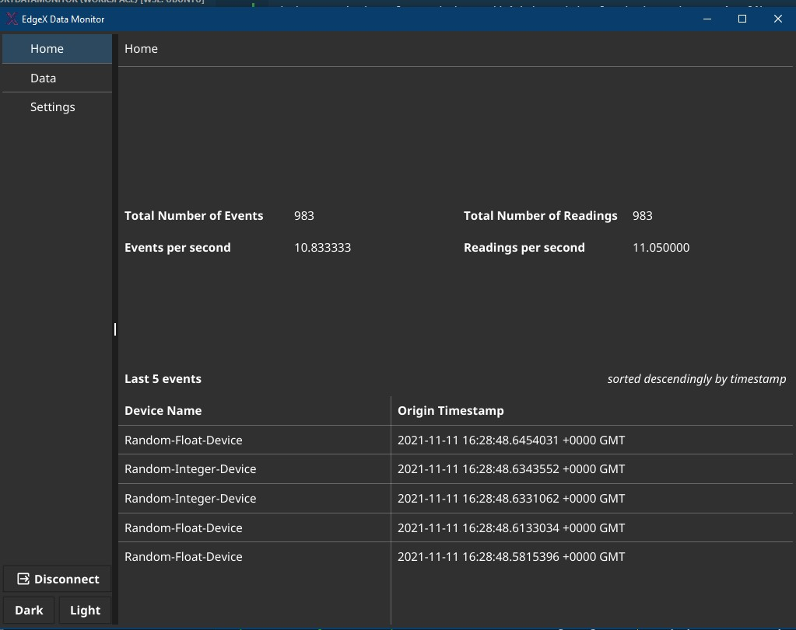

# Edgex Foundry Simple Data Monitor

## Tech stack
* golang v1.17
* [Fyne](https://fyne.io)
* [Edgex Foundry](https://edgexfoundry.org/)
* Docker

## Application Overview
This app subscribe topic from message queue (currently suport MQTT and redis), and present the events and readings (the map of event to
reading is one to many) in screen. The messages are published by virtual devices provided by edgex foundry virtual environment (see [edgex getting started with docker](https://docs.edgexfoundry.org/2.0/getting-started/Ch-GettingStartedUsers/))

Home Preview:



## Prepare environment
### containers
```sh
docker-compose up
```
Service Manage Visualization center: 
> http://localhost:4000

### windows terminal
Please use appropriate C compilers and terminal(such as `MSYS2`) which are defined in [fyne started](https://developer.fyne.io/started/)

## Update application dependencies
```bash
go mod tidy
```
## Run
```bash
cd src/edgex-foundry-datamonitor
go run cmd/app/main.go
```

## Test
```bash
cd src/edgex-foundry-datamonitor
go test ./...
```


## Build
In unix
```bash
chmod +x scripts/build.sh
./scripts/build.sh
```
In windows
```bash
chmod +x scripts/build.sh
./scripts/build-windows.sh
```

These operations will build executable program in `{project_path}/build/`

## Cross-compilation Build
**Install Denpendecies:**
```bash
go install github.com/fyne-io/fyne-cross@latest
go install fyne.io/fyne/v2/cmd/fyne@latest
```

For windows and linux:
```sh
cd ./src/edgex-foundry-datamonitor
fyne-cross windows -app-id edgex-datamonitor -arch=amd64 ./cmd/app
fyne-cross linux -app-id edgex-datamonitor -arch=amd64 ./cmd/app
```

These operations will build binary file in `{project_path}/fyne_cross`, specifically in: 
```
{project_path}/src/edgex-foundry-datamonitor/fyne-cross/bin/windows-amd64
{project_path}/src/edgex-foundry-datamonitor/fyne-cross/bin/linux-amd64
```

For macos：

❗❗❗❗ 🍎
>OSX/Darwin/Apple cross-compiling requires a darwin host and/or some manual steps along with the acceptance of Xcode license terms
Please follow the link below:
https://github.com/fyne-io/fyne-cross#build-the-docker-image-for-osxdarwinapple-cross-compiling

❗❗❗❗

## Test password of Redis Message bus 
As discussed in https://github.com/edgexfoundry/edgex-go/issues/2863, here provided a method to test redis password. 

First, Get secure docker compose from [edgex-compose](https://github.com/edgexfoundry/edgex-compose.git).

Reference [secret store document](https://docs.edgexfoundry.org/2.0/security/Ch-SecretStore/) to get redis password: 
1. Add `SECRETSTORE_REVOKEROOTTOKENS: "false"` to environment of `secretstore-setup` container
2. Start redis secure containers
```bash
docker volume prune # remove volumes if you run no-security containers before
docker-compose up -f docker-compose-secure.yml
```
3. Get root token of vault
```bash
docker exec -it edgex-security-secretstore-setup cat /vault/config/assets/resp-init.json
```
4. Get redis password
```bash
docker exec -it edgex-vault sh
#  in container internal
docker$ vault login <rootToken>
docker$ vault read secret/edgex/core-data/redisdb
```
Now you can copy and paste the password to test application.

**Notes**

I tried to generate a secure docker compose in [edgex-compose](https://github.com/edgexfoundry/edgex-compose.git) by:
```bash
make gen ds-rest ds-virtual
```
But it didn't work, seems like there are bugs now(need change container entrypoint command etc...), hence I used the example docker-compose.yml of repository root folder.

## MQTT issue
The docker-compose was generated in [edgex-compose](https://github.com/edgexfoundry/edgex-compose.git) by:
```bash
make gen no-secty asc-mqtt mqtt-bus ds-mqtt mqtt-broker ds-rest ds-virtual ui
```
However, it doesn't support publish autoevents to MQTT bus (only support redis as my test result), according to the [Add MQTT Device article](https://docs.edgexfoundry.org/2.0/examples/Ch-ExamplesAddingMQTTDevice/), I created a custom mqtt device and script to mock autoevent, see `${project_path}/mqtt/`

## ZeroMq issue
[go-mod-messaging](https://github.com/edgexfoundry/go-mod-messaging) depends on underlying library, so in first challenge, the developer use self-built message queue driver based on go-mod-messaging without zeromq dependencies:
```
I had to patch the referenced https://github.com/edgexfoundry/go-mod-messaging
library because it uses a library that made me lose a whole day while trying to make
it work in my environment. It will be soon deprecated as stated here
https://github.com/edgexfoundry/go-mod-messaging/issues/73
```

Currently my patched version is referenced with a go mod replace entry


## WSL2 GUI

In order to run the Linux version on WSL you need an X11 server like **VcXsrv** launched with the following settings:


And then run the following command, at least this is what I had to do on my machine 😉

```bash
export DISPLAY=$(cat /etc/resolv.conf | grep nameserver | awk '{print $2; exit;}'):0.0
export LIBGL_ALWAYS_INDIRECT=0
```


### License

Apache License Version 2.0