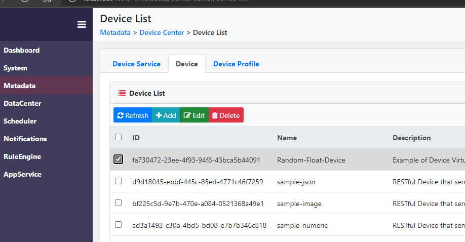
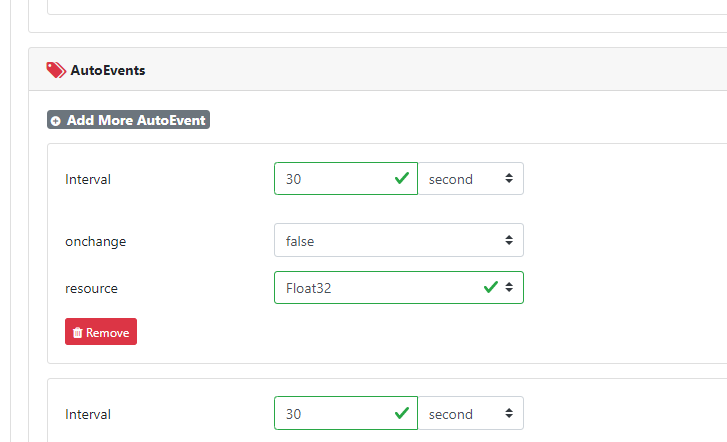
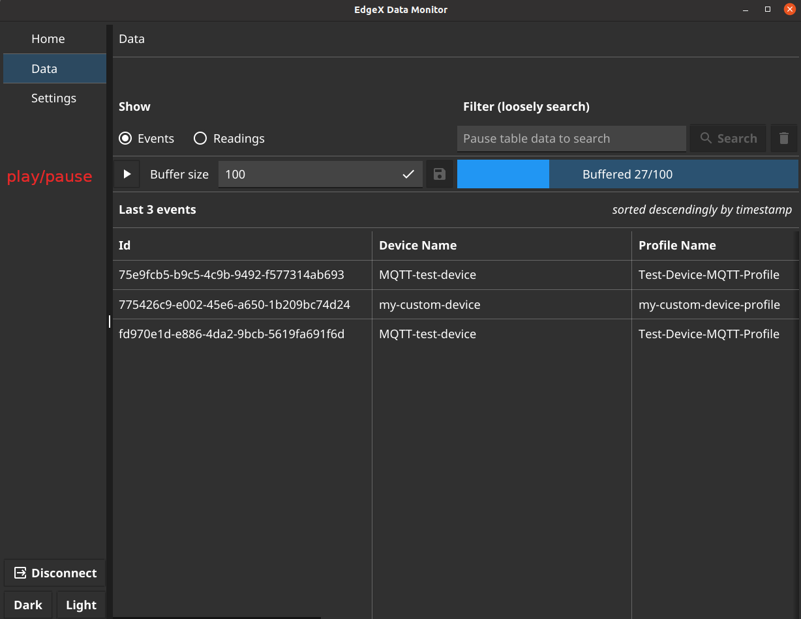
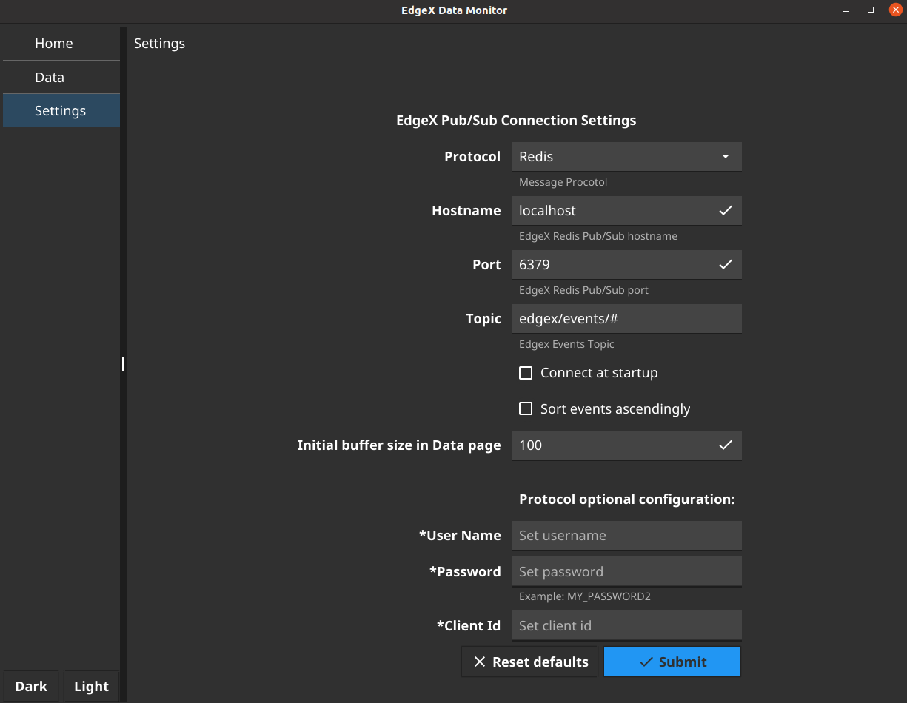

### Home page


Shows Simple statistics and lastest 5 events

## Add more events

In order to verify that the events are coming through and that the calculations are done
correctly you can navigate to
http://localhost:4000/#/metadata/device-center/device-list



Scroll below in the AutoEvents section



And adjust one of the values, for example setting to 1 second.
You’ll notice in home page that the counters will show an increase and the last events will show more
instances of the Device you changed.

## Data page


* There are two types of data can be switched: 
   `Event` or `Reading`
* `Buffer size` can be configured to indicate the number of events/readings that are gonna be kept in memory for further inspection. When the buffer is full, the oldest event/reading is dropped.
The initial value can be changed in the Settings page:


* Play / Pause is in left of `Buffer size`, when in pause mode, we still buffer the data
* Clicking on an event/reading shows its JSON
* Filtering filters within the buffer loosely, it only support on pause mode
**Note the readings filter also match the related fields in father (i.e. match the events which contains these reading)**

* Most of the column will match one filed in related event or reading, Origin and Created timestamps are displayed in user-friendly way (Created = 0 shows empty and not epoch)
* The table resizes with the window, column width is preserved for data readability
(fyne doesn’t offer yet a way to auto-resize them)

## Settings page


Currently support two message queue protocol:
```
    `MQTT` and `Redis`
```

For redis, the optional config is:
>
    `Password`

Fore MQTT, the optional config is:
>
    `ClientId`
    `Password`
    `Username`

**For applying the new procotol, you need click submit**
**After submitting, you need disconnect first before applying the new protocol.**
